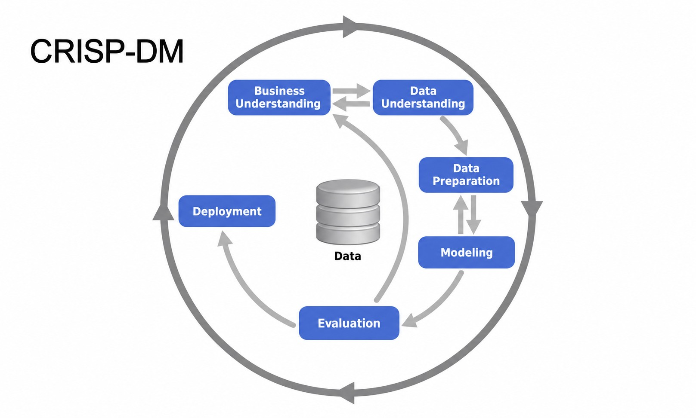

## What is Machine Learning?

Machine learning is a way of making programs learn patterns from data instead of explicitly programming every rule.

A model learns a relationship between input features X and a target y.

Example:

X = house size, location, bedrooms
y = house price

The model learns from previous examples and then predicts the price of a new house.

```text
Data + correct answers
        ↓
     training
        ↓
      model
        ↓
new unseen data
        ↓
   prediction
```

### Rule-based programming vs Machine Learning

**Rule-based system:**

```text
IF study_hours > 5
AND attendance > 80%
THEN predict score > 70
```

You manually create the rules.

**Machine learning:**

```text
study_hours
attendance
previous_exam_score
sleep_hours
        +
final_exam_score
        ↓
      model
```

The model learns the relationship itself from examples.

Important: ML is useful when the rules are too complicated to write manually.

Example: spam detection.

You could try rules like:

```text
if email contains "FREE MONEY" → spam
```

But real spam is much more complicated.

So instead:

```text
thousands of emails + spam/not-spam labels
                ↓
              model
```
## 1.2 ML vs Rule-Based Systems

Official example: **spam detection**.

### Rule-based approach

You manually write rules:

```python
if sender == "promotions@online.com":
    spam = True

if "deposit" in body:
    spam = True
```

Problem: rules keep growing.

Then a real email says:

> “Please return my security deposit.”

Your rule sees `deposit` and wrongly marks it as spam.

So you add more rules, then more exceptions, then more bugs.

### ML approach

Instead of manually writing every rule:

```text
Emails + spam/not-spam labels
          ↓
      extract features
          ↓
       train model
```

Possible features:

```text
title_length > 10
body_length > 10
contains "deposit"
sender domain
specific sender
```

We convert things like:

```text
True  → 1
False → 0
```

So one email could become:

```text
[1, 1, 0, 0, 1, 1]
```

with target:

```text
1 = spam
0 = not spam
```

### Model output

A classifier might return:

```text
0.82
```

Meaning:

> 82% estimated probability of spam.

Then we choose a threshold:

```text
probability >= 0.5 → spam
probability < 0.5  → inbox
```

### Core difference

Rule-based:

```text
Data + manually written rules
           ↓
        decision
```

Machine learning:

```text
Data + known decisions
           ↓
         model
```

The model learns the patterns.

### Important practical point

Rule-based systems are **not bad**.

Often the best path is:

```text
start with rules
↓
learn the problem
↓
turn useful rules into features
↓
move to ML when rules become too complex
```

## 1.3 Supervised Machine Learning

**Supervised ML = learning from examples where the correct answer is already known.**

You give the model:

```text
X = features
y = target
```

Example:

```text
Car:
X = year, mileage, manufacturer
y = price
```

The model learns a function:

```text
g(X) ≈ y
```

Meaning:

> given features `X`, predict something close to the real target `y`.

### Feature matrix `X`

Think of `X` as a table.

Rows = observations
Columns = features

Example:

```text
year   mileage   doors
2020   30000     4
2018   70000     4
2016   90000     2
```

### Target `y`

One answer for each row:

```text
35000
18000
12000
```

---

### Main supervised ML types

**Regression** → predicts a number

```text
house price
salary
temperature
```

**Classification** → predicts a category

Binary:

```text
spam / not spam
fraud / not fraud
```

Multiclass:

```text
cat / dog / car
```

**Ranking** → scores items and sorts them

```text
Google search results
Netflix recommendations
products in an online store
```

## 1.4 CRISP-DM

CRISP-DM is just a structured way to run an ML project.

The 6 steps:

1. **Business understanding**
   Define the real problem and a measurable goal.

2. **Data understanding**
   Check what data you have, whether it is enough, and whether it is trustworthy.

3. **Data preparation**
   Clean data, create features, prepare `X` and `y`.

4. **Modeling**
   Train different models.

5. **Evaluation**
   Check whether the model actually solves the original problem.

6. **Deployment**
   Put the model into real use.

Important point: it is **iterative**.

```text
 problem
    ↓
  data
    ↓
  model
    ↓
 evaluate
    ↓
find problems
    ↓
go back and improve
```


> **Start simple, learn quickly, improve in iterations.**

That matters more than trying to build the perfect model on the first attempt.



## 1.5 Model Selection Process

Goal: **choose the best model without fooling yourself**.

### Split the data

Typical example from the course:

```text
60% train
20% validation
20% test
```

Not fixed. Just a common split.

### What each set does

**Train**

```text
model learns here
```

**Validation**

```text
compare models here
```

**Test**

```text
final check only
```

### Example

Train several models on the same training data:

```text
Logistic Regression → 66%
Decision Tree       → 60%
Random Forest       → 67%
Neural Network      → 80%
```

You pick the best one using the **validation set**.

But there is a problem.

### Multiple comparisons problem

If you try many models on the same validation set, one might look unusually good **just by luck**.

That’s why we keep a separate **test set**.

So:

```text
train models
↓
compare on validation
↓
pick best
↓
check once on test
```

If:

```text
validation = 80%
test       = 79%
```

good.

If:

```text
validation = 80%
test       = 55%
```

something is wrong. The model probably overfit the validation process or got lucky.

### Final trick

After selecting the best model, you can combine:

```text
train + validation
```

and retrain the winning model using more data.

Then evaluate once on the untouched test set.

### Remember

```text
Train → learn
Validation → choose
Test → verify
```

## 1.7 NumPy

Now we code.

Create/open:

```text
01-intro/practice.ipynb
```

### 1. Import NumPy

```python
import numpy as np
```

`np` is just the standard alias.

### 2. Create arrays

Run these yourself:

```python
np.zeros(10)
```

```python
np.ones(10)
```

```python
np.full(10, 2.5)
```

```python
a = np.array([1, 2, 3, 5, 7, 12])
a
```

Access/change elements:

```python
a[2]
```

```python
a[2] = 10
a
```

Remember: indexing starts at `0`.

### 3. Generate sequences

```python
np.arange(3, 10)
```

Gives:

```text
3 4 5 6 7 8 9
```

The end `10` is excluded.

```python
np.linspace(0, 100, 11)
```

Gives 11 evenly spaced numbers from `0` to `100`.

### 4. 2D arrays

```python
n = np.array([
    [1, 2, 3],
    [4, 5, 6],
    [7, 8, 9]
])

n
```

Get row 0, column 1:

```python
n[0, 1]
```

Get entire third row:

```python
n[2]
```

Get entire second column:

```python
n[:, 1]
```

Key:

```text
n[row, column]
:
means "all"
```

### 5. Random arrays

```python
np.random.seed(2)
np.random.rand(5, 2)
```

`seed(2)` makes the random result reproducible.

Normal distribution:

```python
np.random.seed(2)
np.random.randn(5, 2)
```

Random integers:

```python
np.random.randint(0, 100, size=(5, 2))
```

### 6. Element-wise operations

This is one of NumPy's biggest advantages.

```python
a = np.arange(5)
a
```

```python
a + 1
```

```python
a * 2
```

```python
a ** 2
```

No manual loop needed.

### 7. Comparisons and filtering

```python
a >= 2
```

returns:

```text
False False True True True
```

Then:

```python
a[a >= 2]
```

returns only:

```text
2 3 4
```

This pattern becomes **very important in data science**:

```python
array[condition]
```

### 8. Summary operations

```python
a.min()
a.max()
a.sum()
a.mean()
a.std()
```

## 1.8 Linear Algebra Refresher

This lesson matters because **linear regression later uses this directly**.

### 1. Vector operations

```python
u = np.array([2, 4, 5, 6])
v = np.array([1, 0, 0, 2])
```

Scalar multiplication:

```python
2 * u
```

Vector addition:

```python
u + v
```

Nothing special yet.

---

### 2. Dot product

This is **not** element-wise multiplication.

Element-wise:

```python
u * v
```

gives:

```text
[2, 0, 0, 12]
```

Dot product:

```python
u.dot(v)
```

does:

```text
2*1 + 4*0 + 5*0 + 6*2
= 14
```

So:

```python
u.dot(v)
```

returns:

```text
14
```

Think:

```text
vector · vector → single number
```

---

### 3. Matrix × vector

```python
U = np.array([
    [2, 4, 5, 6],
    [1, 2, 1, 2],
    [3, 1, 2, 1]
])
```

Then:

```python
U.dot(v)
```

NumPy takes each row of `U` and computes its dot product with `v`.

Result:

```text
[14, 5, 5]
```

Think:

```text
matrix × vector → vector
```

---

### 4. Matrix × matrix

```python
V = np.array([
    [1, 1, 2],
    [0, 0.5, 1],
    [0, 2, 1],
    [2, 1, 0]
])
```

Then:

```python
U.dot(V)
```

For multiplication to work:

```text
U shape = (3, 4)
V shape = (4, 3)
```

The **inside dimensions must match**:

```text
(3, 4) × (4, 3)
     ↑     ↑
     same
```

Result shape:

```text
(3, 3)
```

Rule:

```text
(a, b) × (b, c) → (a, c)
```

This rule is important.

---

### 5. Identity matrix

```python
I = np.eye(3)
```

gives:

```text
1 0 0
0 1 0
0 0 1
```

It behaves like `1` in normal multiplication.

```python
A.dot(I)
```

returns:

```text
A
```

---

### 6. Matrix inverse

If:

```python
A_inv = np.linalg.inv(A)
```

then:

```python
A_inv.dot(A)
```

gives approximately:

```text
I
```

Inverse is written mathematically as:

```text
A⁻¹
```

Important correction to the course wording: **not every square matrix has an inverse**. A square matrix must also be **invertible/non-singular**.


### Remember

```text
vector · vector → number
matrix · vector → vector
matrix · matrix → matrix

(a,b) × (b,c) → (a,c)
```

## 1.9 Pandas

Pandas is for **tabular data**. Think Excel/SQL tables, but in Python.

### 1. Import

In `practice.ipynb`:

```python
import pandas as pd
import numpy as np
```

Main object:

```text
DataFrame = whole table
Series    = one column
```

---

### 2. Create a DataFrame

```python
data = [
    ['Nissan', 'Stanza', 1991, 138, 2000],
    ['Hyundai', 'Sonata', 2017, None, 27150],
    ['Lotus', 'Elise', 2010, 218, 54990],
    ['GMC', 'Acadia', 2017, 194, 34450],
    ['Nissan', 'Frontier', 2017, 261, 32340],
]

columns = ['Make', 'Model', 'Year', 'Engine HP', 'MSRP']

df = pd.DataFrame(data, columns=columns)
df
```

First thing you usually do:

```python
df.head()
```

---

### 3. Select columns

One column:

```python
df['Make']
```

returns a **Series**.

Multiple columns:

```python
df[['Make', 'Model', 'MSRP']]
```

returns a **DataFrame**.

I recommend bracket syntax:

```python
df['Engine HP']
```

instead of:

```python
df.Engine_HP
```

because bracket syntax works with any column name.

---

### 4. Rows: `loc` vs `iloc`

```python
df.loc[1]
```

`loc` uses the **index label**.

```python
df.iloc[1]
```

`iloc` uses the **position**.

Easy memory trick:

```text
loc  → label
iloc → integer position
```

---

### 5. Filtering

Cars newer than 2015:

```python
df[df['Year'] >= 2015]
```

Nissan cars:

```python
df[df['Make'] == 'Nissan']
```

Multiple conditions:

```python
df[
    (df['Make'] == 'Nissan') &
    (df['Year'] >= 2015)
]
```

This pattern is extremely important:

```python
df[condition]
```

---

### 6. String operations

Convert strings to lowercase:

```python
df['Make'].str.lower()
```

Replace spaces:

```python
df['Make'].str.replace(' ', '_')
```

You can chain them:

```python
df['Make'].str.lower().str.replace(' ', '_')
```

---

### 7. Summary statistics

```python
df['MSRP'].mean()
df['MSRP'].min()
df['MSRP'].max()
```

Very useful:

```python
df.describe()
```

For unique values:

```python
df['Make'].nunique()
```

See the actual unique values:

```python
df['Make'].unique()
```

---

### 8. Missing values

Our Hyundai has:

```text
Engine HP = None
```

Pandas turns that into `NaN`.

Find missing values:

```python
df.isnull().sum()
```

You will use this **constantly** in real ML work.

---

### 9. Grouping

Average price by manufacturer:

```python
df.groupby('Make')['MSRP'].mean()
```

Think SQL:

```sql
GROUP BY Make
```

Same idea.

---

### 10. Pandas → NumPy

```python
df['MSRP'].values
```

returns the underlying NumPy array.

---

### 11. DataFrame → dictionaries

```python
df.to_dict(orient='records')
```

Useful later for APIs and ML prediction services.

---

### The Pandas commands worth memorizing

```python
df.head()
df.shape
df.columns
df.dtypes

df['column']
df[['col1', 'col2']]

df.loc[]
df.iloc[]

df[condition]

df.describe()
df.nunique()
df.isnull().sum()

df.groupby(...)

df['column'].values
```

## 1.10 Summary

Module 1 is basically this:

* **ML** = learn patterns from data
* **Features `X`** = inputs
* **Target `y`** = thing to predict
* **Supervised ML** = known `X` and `y`
* **Regression** = number
* **Classification** = category
* **Ranking** = ordered results
* **CRISP-DM** = full ML project lifecycle
* **Train** = learn
* **Validation** = choose model
* **Test** = final check
* **NumPy** = numerical arrays
* **Linear algebra** = vector/matrix operations
* **Pandas** = tabular data

The most important idea from this module is:

```text
X + y
  ↓
train model
  ↓
model learns patterns
  ↓
new X
  ↓
prediction
```
